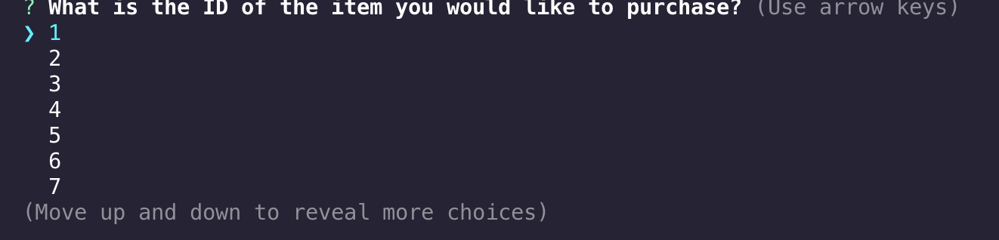
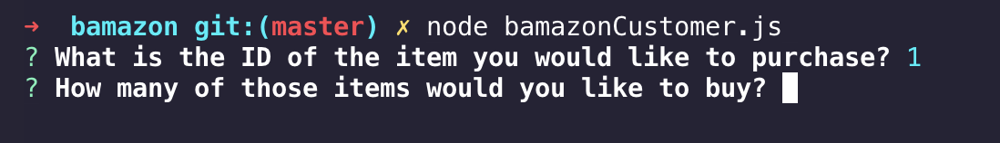
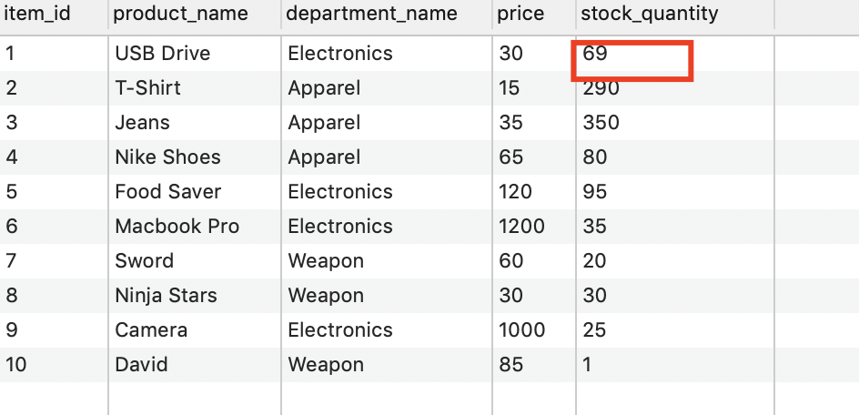

# bamazon

## Introduction
Welcome to my bamazon app! This is an Amazon-like storefront app that utilizes node.js and mySQL. Customers can interact with this app through the command line to view a list of the store's inventory, select an item to purchase, select the quantity of that item and bamazon will calculate your total cost.

## Accessing the App
To access the app, initiate your terminal and access my bamazon folder. In this folder, type into the command line "node bamazonCustomer.js" and hit enter.

## Product Listing
When you initate the app, you will be given a list of available items and it's quantity.

## Customer Prompt - Select Item ID
At the bottom of the list, you will be prompted to select an item from the list. Predefined choices will be listed by Item ID. You can use your up and down arrow keys to move up and down the list of choices. When you arrive at your choice, hit return to select it.

## Customer Prompt - Select Quantity
Once you have chosen an item, you will be asked how many of that item you wish to purchase. Here, you will be able to enter a number.

## Purchase Confirmation
Once you have selected an item and quantity, you will be asked to confirm your purchase. Your choices will either be "Confirm" or "Cancel". If you confirm, your purchase will be completed and reflected in the mySQL database. If you select "Cancel", the transaction will be canceled.

## Updated mySQL database
As you can see, the bamazon database has been updated with the new inventory amount for that selected product.

